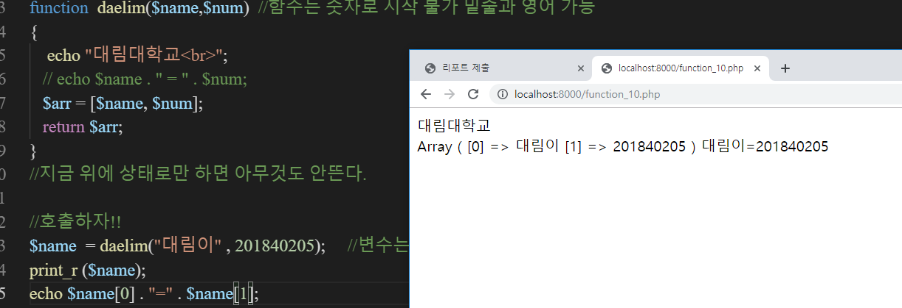
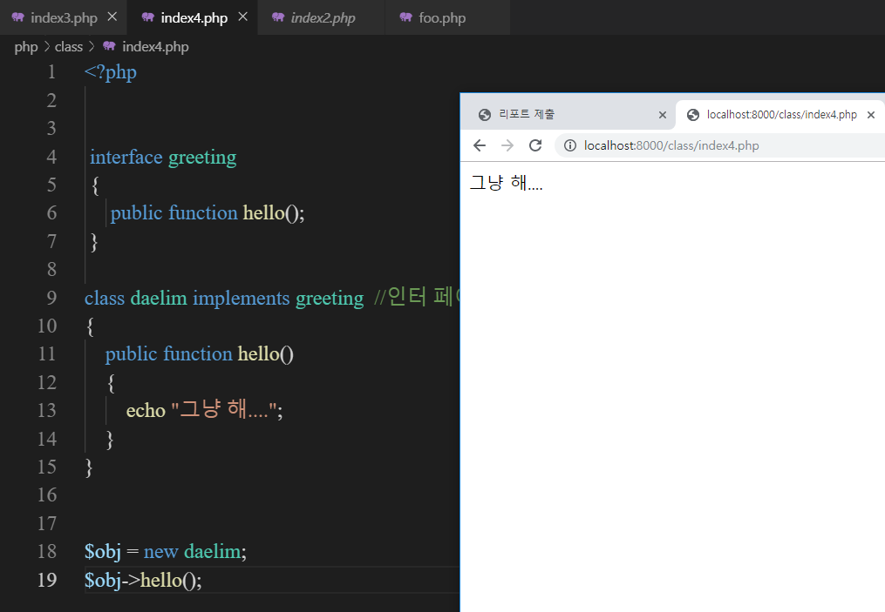
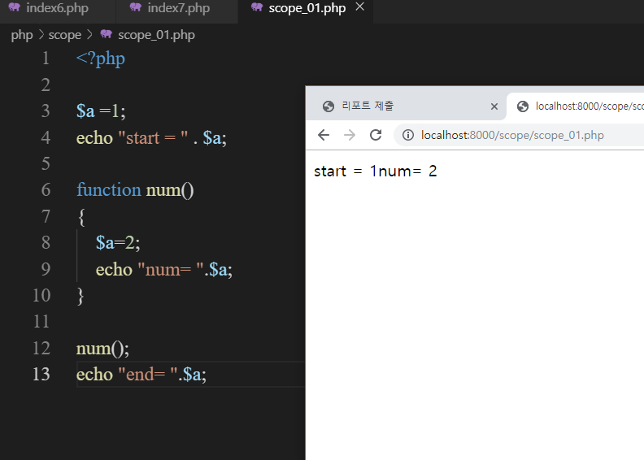

# 수업 2019.09.25
수업내용 정리 

## Class에 대한 수업

<5주차 php 시간에 만든 파일들>

## 1.include 하는 법 

해당 만들어둔 파일에 hello_10.php 파일과 hello_11.php 파일을 만들어 해당 include문을 이용해 hello_11.php파일을 실행하게 되면 hello_10.php파일을 가져와 활성화 되는 것을 알 수 있다.

< hello_11.php 파일이 실행되는 사진>

## 2. localhost 활성화 하기

그전에 하던 방식은 php –S localhost:8000 과 php –S localhost:8000 –t ./php로 해도 활성화가 된다.
(단 ./php는 현재 위치의 php 폴더를 위미하는 것이다.)

## 3. 호출 방법
폴더 안에 function_10,php 파일을 만든 뒤 daelim()으로 호출하는 것을 알 수 있다.

Tip c언어나 자바 같은 경우 변수 선언을 위해서는 자료형을 이용해 변수를 선언 하지만 
php파일의 경우 ‘$’ 표기 방식으로 변수를 선언한다.

## 4. 배열을 이용해 보기

배열을 이용해서 해당 파일을 print하기

## 5. class를 이용한 코드 

처음에는 class_01.php 파일과 class_02.php 파일들을 만든 뒤

class_01.php ==> left.php로 class_02.php ==>right.php로 만든다.

그 후에 

autoload.php 파일을 만든 뒤 left와 right php 파일을 연결해 주면 위 사진과 같이 연결이 된다. 이 방법은 	클래스를 쉽게 한 번에 불러 올 때 사용

## 5-1 캡술화

캡슐화에 필요한 함수들을 묶어버리기

## 5-2 캡슐화 2

## 6 클래스 설명 

->는 참조한다 라는 의미  각각 선언, 생성, 호출 3단계로 나뉘어서 한다.

아래 사진은 실행된 화면입니다.

## 7. 인터페이스 사용 

기본적으로 인터페이스를 참조하기 위해서는 implements를 이용해 사용한다.

## 8. 추상 클래스 사용
일반 클래스와 다른 추상 클래스를 사용해 보자

추상 클래스는 선언을 위해서 abstract를 입력 후 사용한다

## 9. namespace 사용 

namespace를 통해 경로를 정해 파일 참조하기

## 10. scope 사용 하기 

해당 scope_01.php 파일은 function 함수 안에 값이 참조되는 것과 function 밖에 참조되는 값의 차이를 보여주는 코드와 실행 결과이다.

## 11. scope 파일에 글로벌 전역 함수를 써보자

글로벌 함수 표시식인 global를 사용하면 전체 모든 곳에 값이 참조되는 것을 알 수 있다.

함수 블록 안과 밖은 서로 분리되어 있지만 global를 사용하게 되면 전역 변수처럼 쓸 수 있다.

## 12. 서버 주소 불러오기

echo　$SERVER[“REQUEST_URI]; 라는 코드는 지금 내가 사용하고 있는 서버에 대한 정보를 주는 것이다.
위에 사진을 보면 해당 서버의 경로가 나오는 것을 알 수 있다.

