# 수업 2019.10.23
수업내용 정리 

##  Database 연동 및 실행 수업

<Database 연동을 위한 선 작업>

## 1. PhP.ini 파일
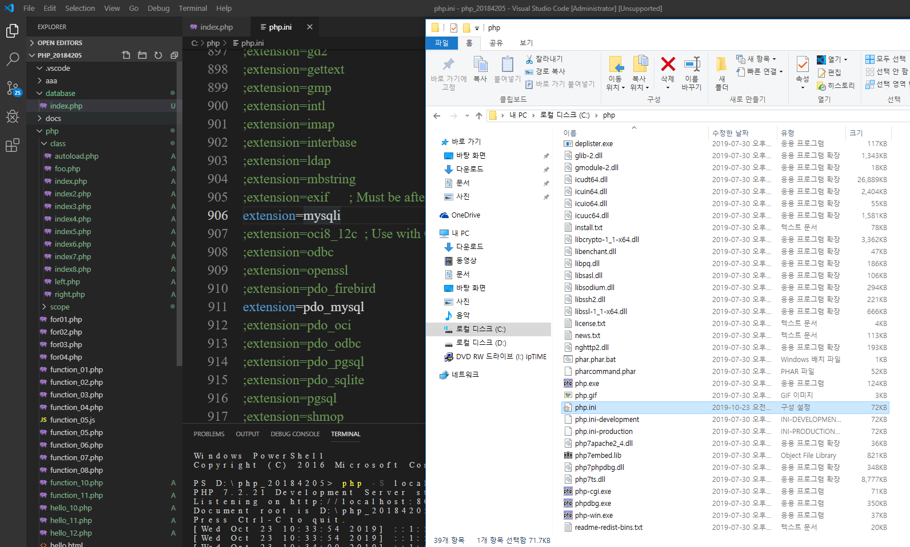

## 2.php.ini 파일의 주석 활용
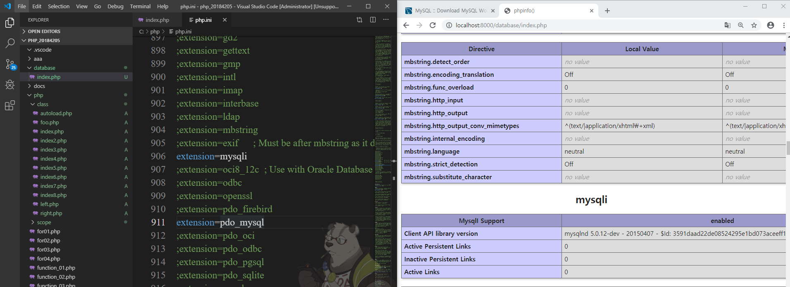

## 3. 코드 1 

## 4. DB 연동 성공
 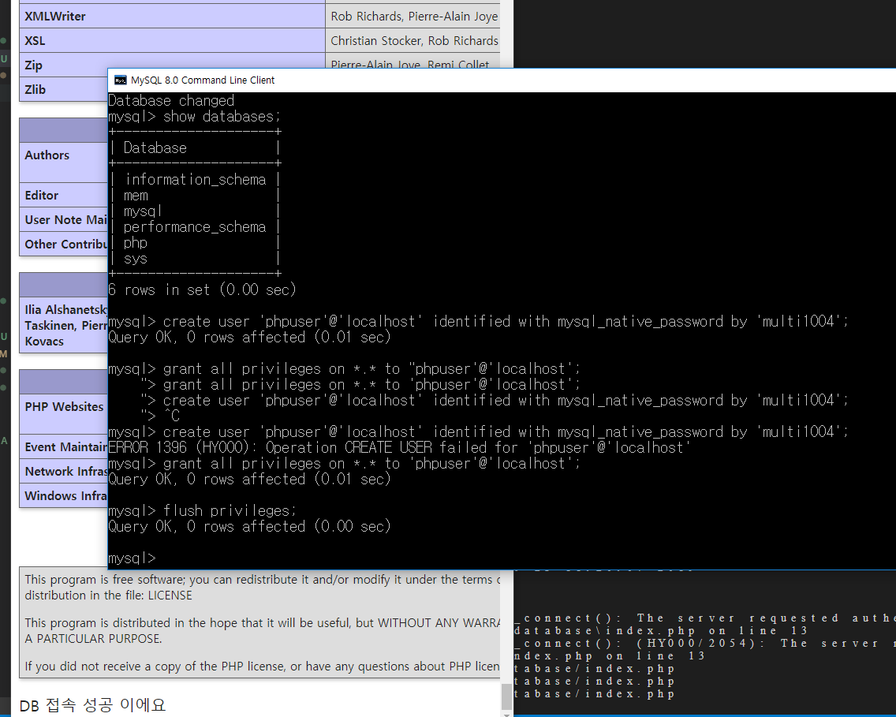

 ## 4 -1 보강 
 

 ## 5. include로 연동하기
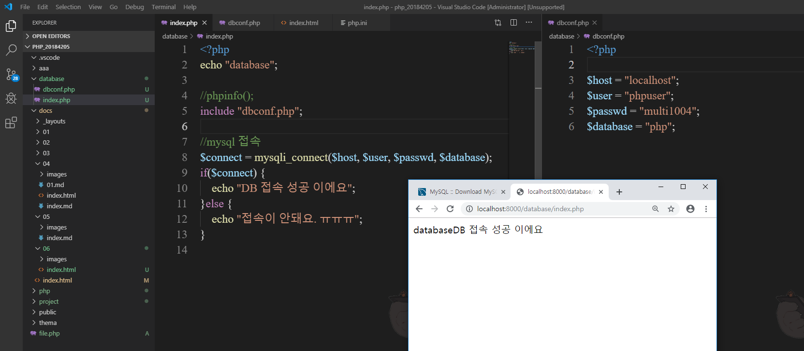
 
    dbconf.php 파일을 새로 만든 뒤 host,user, passwd, database 선언 후 index.php 파일에 connect로 연결해 사용한다.  

## 6. connect_error 활용 
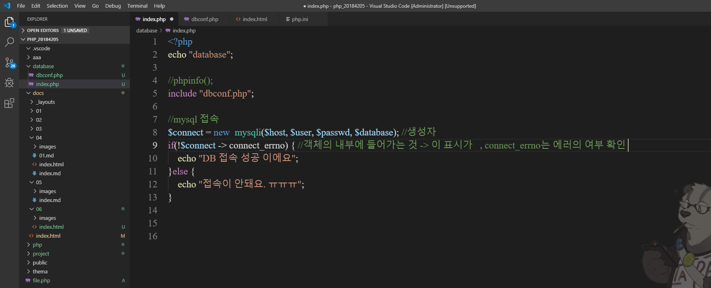
    객체의 내부에 들어 가는 것  -> 표시가 , connect_error는 에러의 여부 확인

## 7.  성공과 실패 
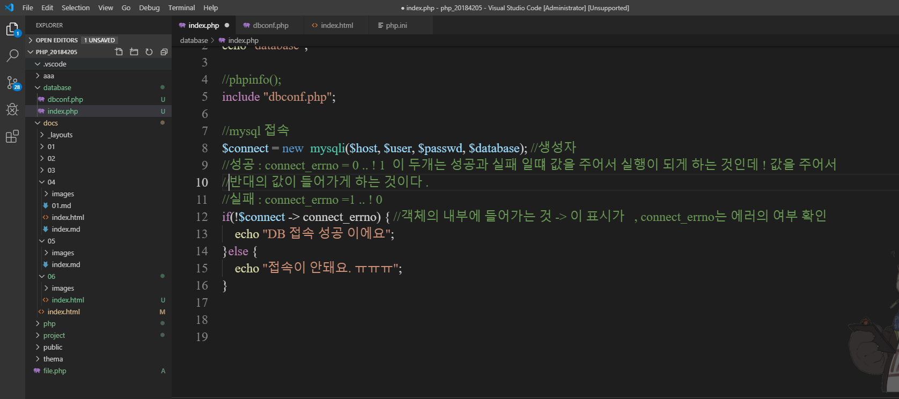

        성공 : connect_errno = 0
        실패 : connect_errno = 1 같이 값을 넣어 주는 형태이다.
         
## 8. 테이블 만들기
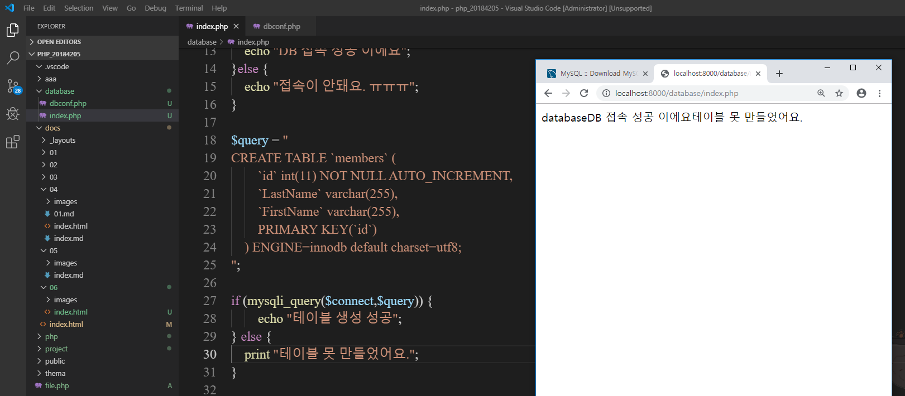
    테이블을 만들어 보기

## 9.  클래스 생성

    require로 불러오기

## 10. 복합 객체 사용 

    복합 객체 생성 및 사용 

## 11. 테이블 갯수

 .$count 사용 해서 테이블의 갯수 확인 

 ## 12.  코드 2
 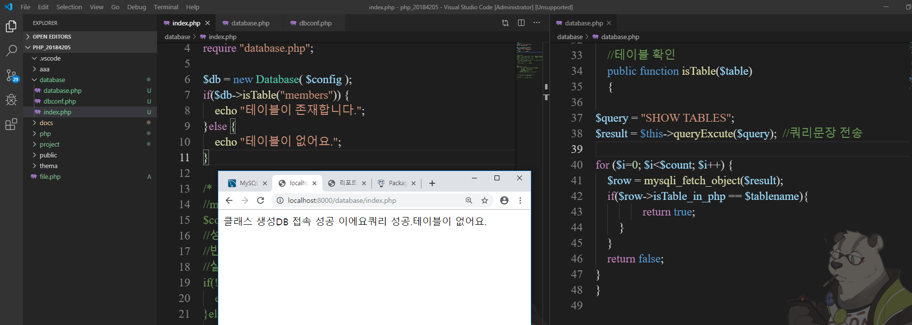
 쿼리 생성과 테이블의 유뮤 확인 코드

 ## 13. 파일명 구분 
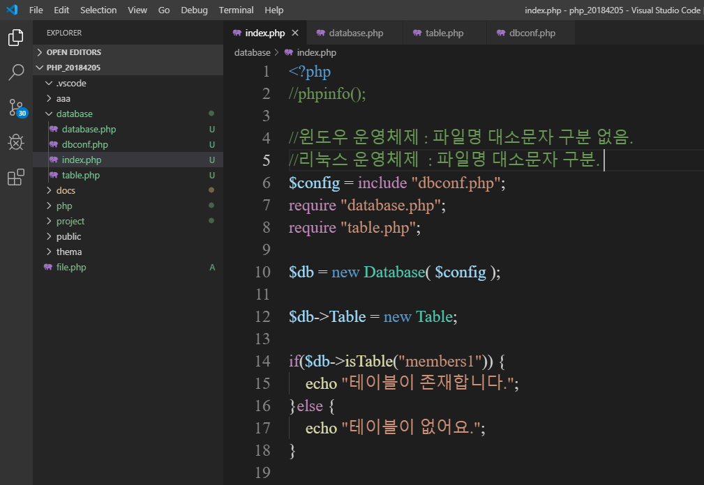
    윈도우 운영 체제는 파일명의 대소문자 구분이 없음 그러나 리눅스 운영체제의 경우 파일명의 대소문자 구분이 필요하다.

## 14. 테이블 클래스 생성 
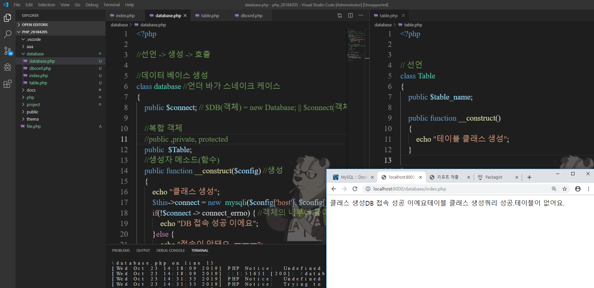
복합 객체를 이용한 테이블 클래스 생성 

## 15. getter, setter 사용 

간단하게 한 것... 이러한 방법도 있다.

## 16. 성공 
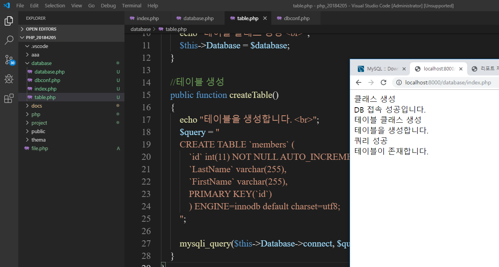
테이블에 관한 내용 추가하면 해당 실행 결과가 나온다.

## 17. 프로그램의 다양한 패턴들
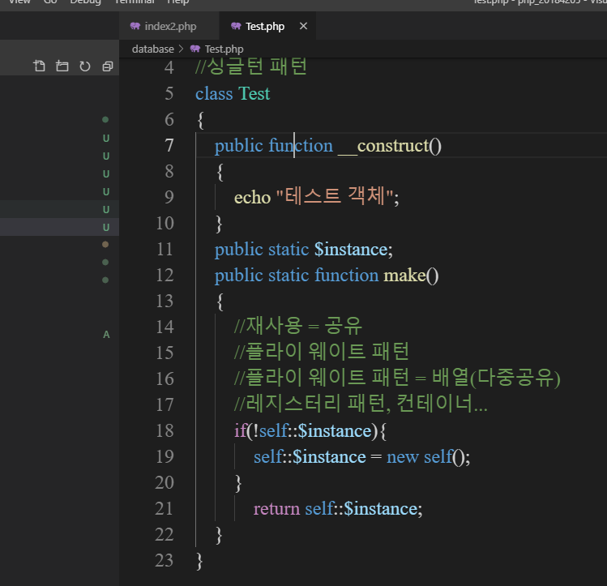

다양한 패턴들 존재 

