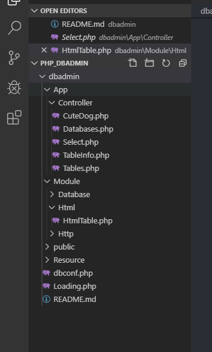

# 수업 2019.11.06
수업내용 정리 

## mysql 테이블과 풀 리퀘스트 하기

<작업을 위한 mysql cmd 창띄우기>

## 1. db 값 넣기

member 테이블 안에 값 넣기 

## 2.목록 뽑기

만든 사이트에 데이터 베이스에 넣은 값을 출력하기 

## 3. 한번 더!!

똑같이 데이터 값을 넣고 다시 출력하기

## 4.uri 활용

SERVER로 불러 오기

## 5. 출력 1

데이터 없음 이라고 출력됨

## 6. if문을 이용한 출력

## 7. Uri 클래스 생성

## 8.php_dbadmin 이라는 폴더 생성

그 후 교수님 파일을 fetch 해서 db 연결하기

## 8-1. 순서 1

## 8-2. 순서 2

## 8-3. 순서 3

## 8-4. 순서 4

## 9. fetch 하기

## 10. html파일 만들고

## 11. git 추가하기

해당 명령문 치기

## 11-1. fetch 성공

## 12. 풀 리쿼스트

전체 학생들을 위한 풀리쿼스트로 파일을 보내주기

