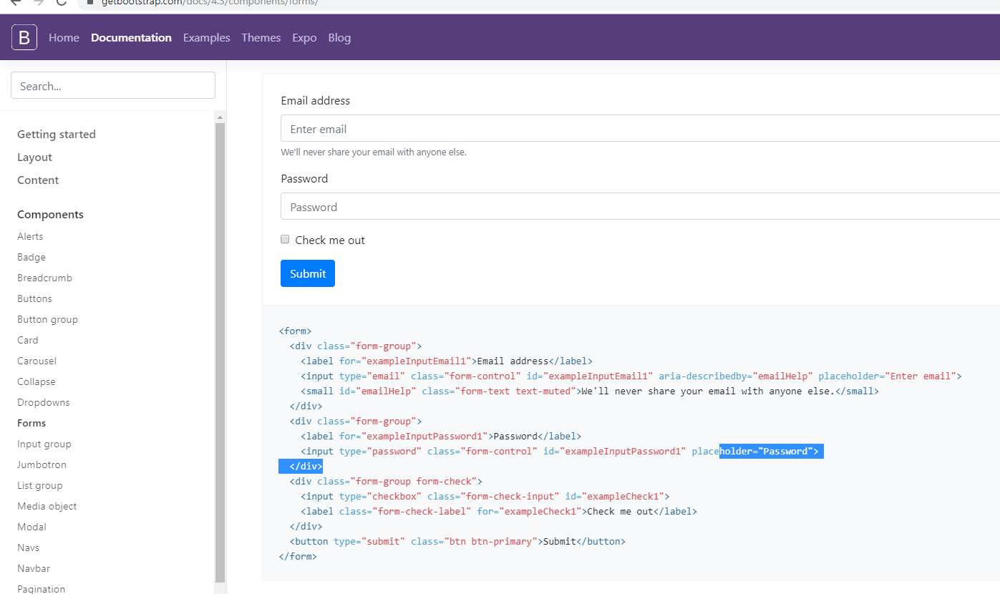

# 수업 2019.11.20
수업 내용 정리

## 사이트의 로그인과 DATABASE 생성

## bootstrap에서 복사해 오기

## html 파일에 로그인 정보 추가하기

## login.php 파일 생성 하기

### namespace는 별도로 지정해주기

## main문을 만들어서 출력해주기

## session을 이용해서 저장 한 값을 저장 후 출력하기

## 사이트에 로그인 창 만들기

## 설정한 아이디와 비밀번호로 로그인을 하면 로그인 확인 메세지와 해당 아이디와 비밀번호 출력

### session에 저장된 아이디 값과 비밀번호 값을 str_replace을 이용해 출력해주는 것이다.

## 로그인 성공을 하면 페이지 이동한다.

### header("location:"."/database"); 라는 코드를 치면 로그인 성공과 동시에 위치가 이동하게 된다.

## 버튼 클릭 추가하기

### const addBtn = document.getElementById("addNew"); 부분의 코드를 입력하게 되면 버튼을 눌렀을 때 해당 메세지가 출력된다.

## uri를 이용한 출력하기

## table_new.html 파일을 생성해서 생성 버튼을 추가하기

## 컬럼 추가 만들기

## 컬럼  추가 버튼을 누루게 되면

## 변수 형태 만들기

                      <label for="fieldtype">데이터 타입</label>
                      <select name="fieldtype" class="custom-select my-1 mr-sm-2" id="inlineFormCustomSelectPref">
                          <option value="varchar(255)"selected>가변문자열</option>
                          <option value="int(11)">정수값</option>
                          <option value="text">텍스트값</option>
                          <option value="datetime">날짜시간</option>
                      </select>   
                  
 형태로 desc_new.html 파일에 넣어준다.

## 테이블 삭제와 추가하기

